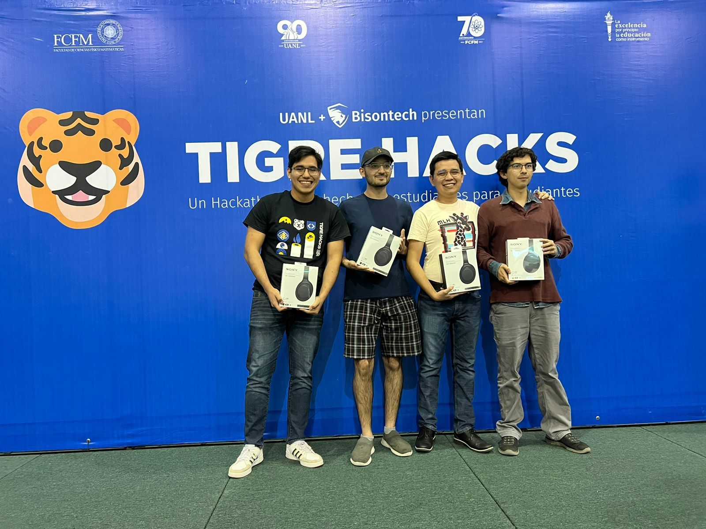
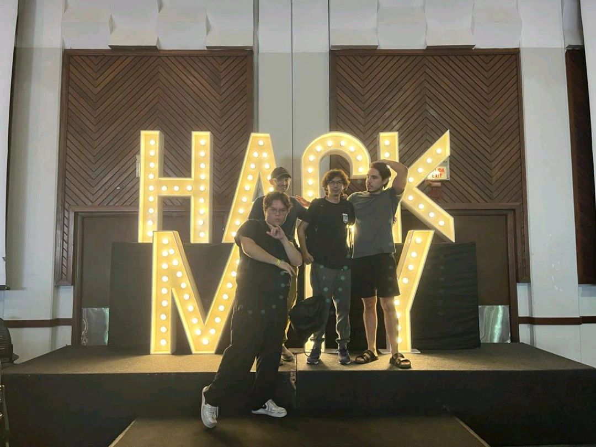

### Hi there 👋 I'm Pablo González

## 🖖 About Me

💻 Software Engineering and Data Science enthusiast currently working as a Data Engineer ✏️
- 🔭 I’m currently working on my operations research paper
- 🌱 I'm a Research Assistant at Mexico's National Research Service III - National Council for Science and Technology
- 🎓 I have a bachelor's degree in Software Engineering by the Autonomous University Nuevo León (UANL) 🐯
- 🌎 I'm fluent in spanish, english and currently learning french
- 📖 I love reading

- 🏆 Two time MLH-Hackathon participant and winner 
   - 🥈 2nd place TigreHacks 2023 - UANL - [tigereye](https://github.com/matavaresr/tigereye)
     

      
      

   - 🎖️ Top 10 projects HackMty 2023 - Tec de Monterrey - [kaban](https://github.com/Special-Unitary-Group/kaban)
      

      
      

</td><td valign="top" width="33%">
